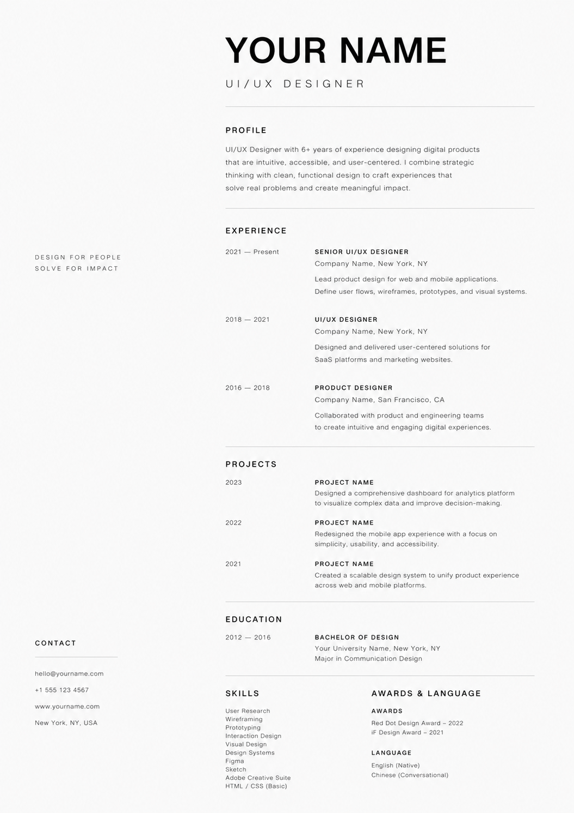
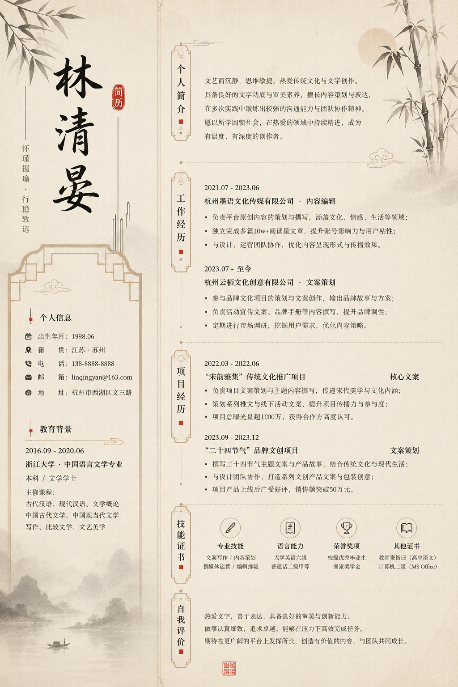
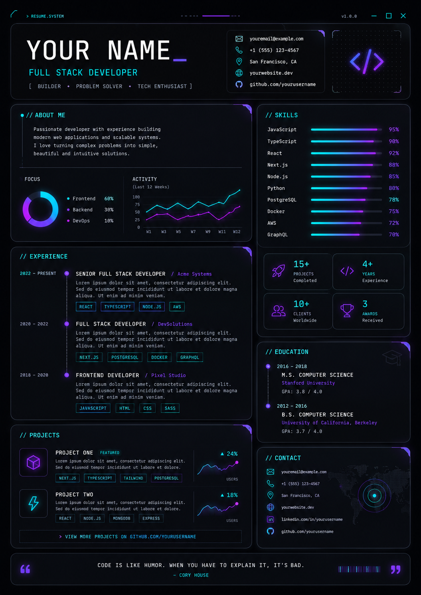
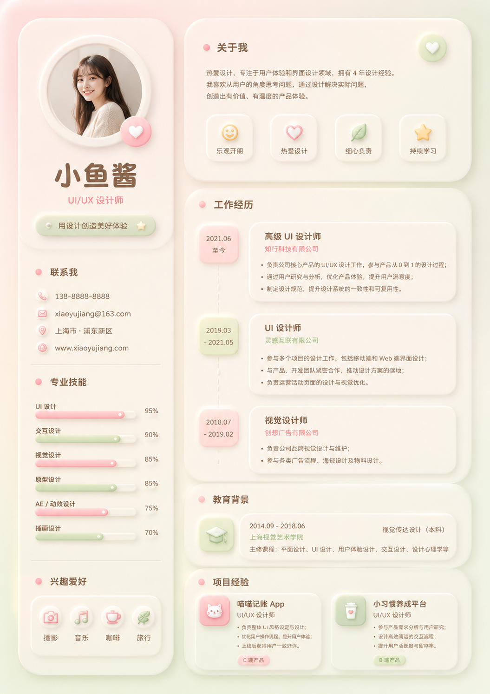
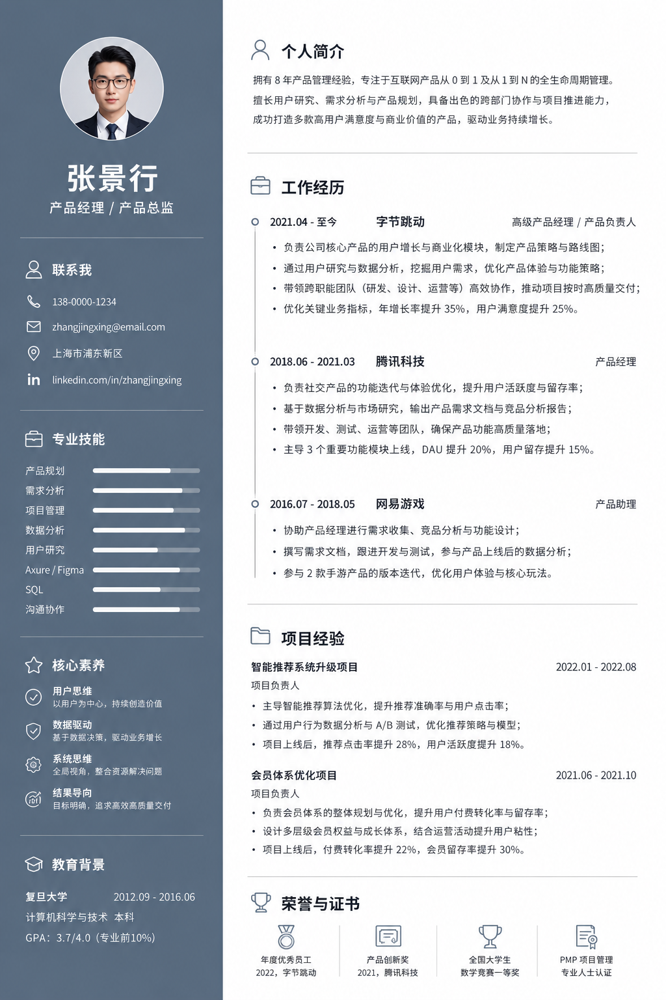
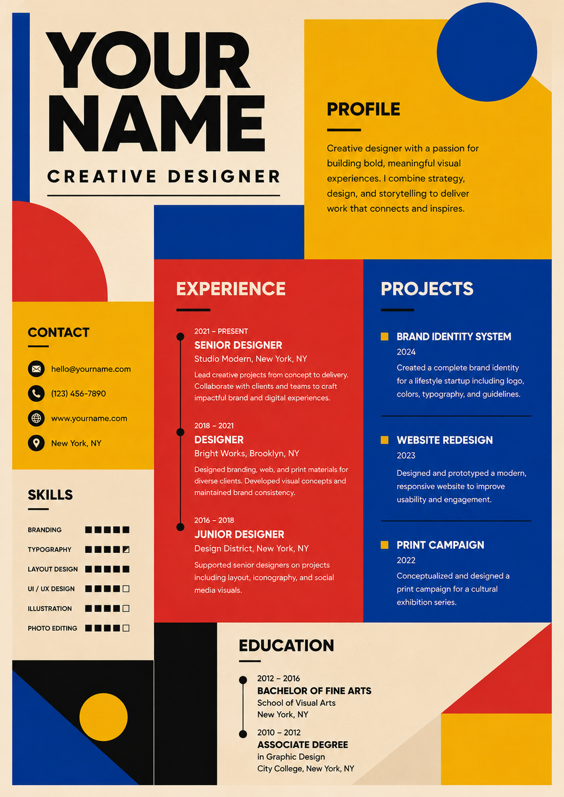
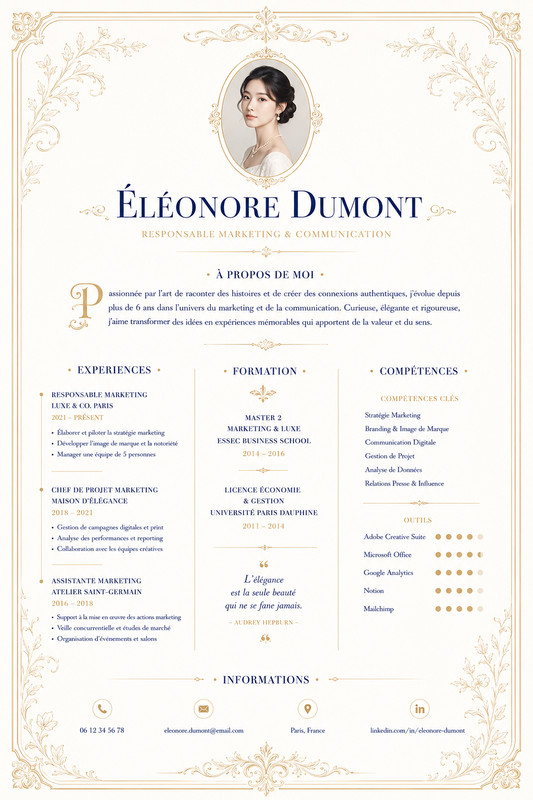
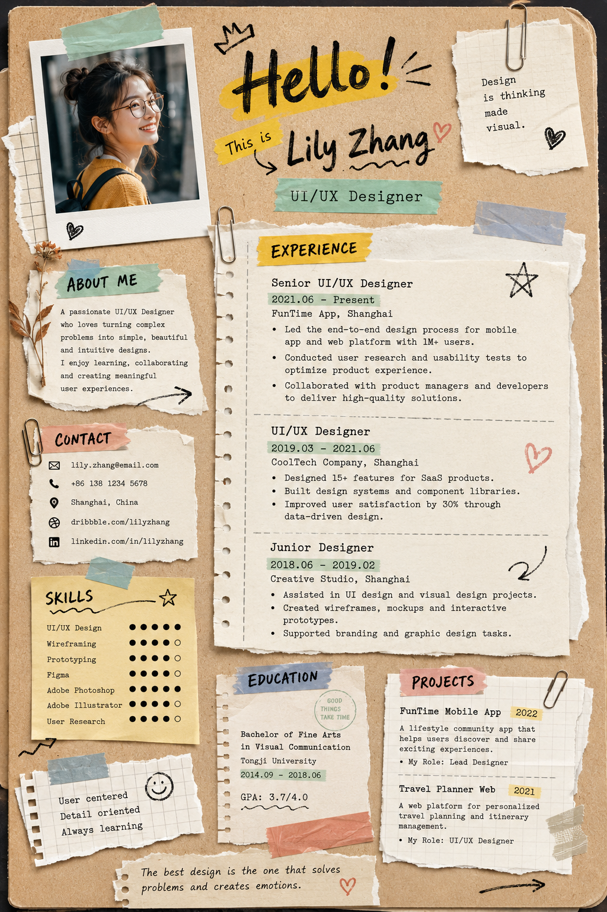
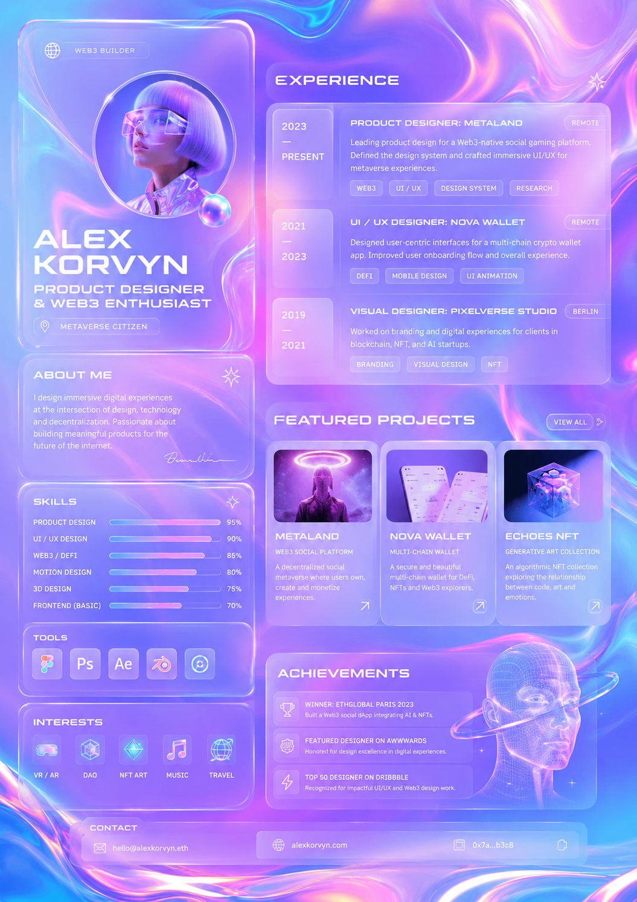

# Resume Factory

[Read the Chinese version](README_zh.md)

Resume Factory is an Agent Skill for Codex and Claude Code that creates a visually validated, one-page LaTeX resume. It includes ten styles, matching previews, and deterministic compilation and layout checks. Every user-provided content item must remain in the finished resume; the skill adjusts font size and layout instead of shortening or inventing content.

## Install the Skill

Move or copy the entire project directory to the personal Skill directory for your agent. The resulting directory must retain `SKILL.md`, `templates/`, `examples/`, and `scripts/`.

### Codex

Open the downloaded `resume-factory` project directory in a terminal, then run from the current directory:

```bash
mkdir -p "$HOME/.codex/skills"
cd ..
mv "$PWD/resume-factory" "$HOME/.codex/skills/resume-factory"
```

### Claude Code

Open the downloaded `resume-factory` project directory in a terminal, then run from the current directory:

```bash
mkdir -p "$HOME/.claude/skills"
cd ..
mv "$PWD/resume-factory" "$HOME/.claude/skills/resume-factory"
```

See the official [Claude Code Skills documentation](https://code.claude.com/docs/en/skills#where-skills-live).

If the Skill does not appear after installation, restart the corresponding agent. Once installed, you do not need to use this project as your working directory.

## Prepare a working directory

Open Codex or Claude Code in any working directory, then run:

```bash
mkdir -p inputs
mkdir -p outputs
```

Place one clear portrait in `inputs/` as a `.jpg`, `.jpeg`, or `.png`; Resume Factory discovers it automatically. For file-based generation, also place the source `.pdf` or `.md` resume in `inputs/`. Generated `.tex` and `.pdf` files are written to `outputs/`.

If `inputs/` contains multiple portraits, the agent will ask which one to use. The prompt does not need to repeat the portrait path or any layout instructions.

## Initial setup

Resume Factory requires Python 3.8 or later, PyMuPDF, XeLaTeX, the `geometry`, `xcolor`, `tikz`, `fontspec`, `xeCJK`, `graphicx`, and `fontawesome5` packages, and the TeX Gyre and Fandol OpenType fonts. Install them as follows; the procedure differs by operating system.

### macOS

Run these commands from the installed Skill directory:

```bash
pip install -r requirements.txt
brew install --cask mactex-no-gui
eval "$(/usr/libexec/path_helper)"
```

This installs the complete command-line MacTeX distribution. Use `brew install --cask mactex` instead if you also want TeXShop and the other graphical applications.

### Linux

Ubuntu or Debian:

```bash
pip install -r requirements.txt
sudo apt update
sudo apt install -y texlive-full
```

Fedora or RHEL-based distributions:

```bash
pip install -r requirements.txt
sudo dnf install -y texlive-scheme-full
```

Arch Linux or Manjaro:

```bash
pip install -r requirements.txt
sudo pacman -Syu --needed texlive-meta
```

### Windows

Run this command from the installed Skill directory in PowerShell or Command Prompt:

```powershell
pip install -r requirements.txt
```

Then download and run the official [TeX Live Windows installer](https://mirror.ctan.org/systems/texlive/tlnet/install-tl-windows.exe). Open `Advanced`, select `full scheme (everything)`, complete the installation, and reopen the terminal so the updated `PATH` takes effect.

After installation on any system, run these commands to verify it:

```bash
xelatex --version
kpsewhich geometry.sty
kpsewhich fontawesome5.sty
kpsewhich texgyreheros-regular.otf
kpsewhich FandolHei-Regular.otf
```

## Quick start

### Usage 1: provide resume details directly

```text
Please invoke the resume-factory Skill and create my resume with this configuration:
- Reference Style ID: resume_template_5
- Target language: English
- Output file base name (without extension): alex_chen_resume
- Resume details: [Paste all resume content here.]
```

### Usage 2: use an existing resume as reference (PDF and Markdown supported)

```text
Please invoke the resume-factory Skill and create my resume with this configuration:
- Reference Style ID: resume_template_3
- Target language: English
- Input filename: alex_chen_resume.pdf (or alex_chen_resume.md)
- Output file base name (without extension): alex_chen_restyled
```

No additional prompt instructions are required. Content fidelity, one-page fitting, template typography, compilation, inspection, and cleanup are enforced by `SKILL.md` and the helper scripts.

## Style catalog

| Style ID | Style | Preview |
| --- | --- | --- |
| `resume_template_1` | Minimal Monochrome UI/UX |  |
| `resume_template_2` | Chinese Ink Cultural |  |
| `resume_template_3` | Cyberpunk Developer Dashboard |  |
| `resume_template_4` | Pastel Neumorphism UI/UX |  |
| `resume_template_5` | Corporate Blue Sidebar |  |
| `resume_template_6` | Bauhaus Bold Creative |  |
| `resume_template_7` | French Neoclassical Luxury |  |
| `resume_template_8` | Scrapbook Collage UI/UX |  |
| `resume_template_9` | Holographic Web3 Glassmorphism |  |
| `resume_template_10` | Botanical Watercolor Psychology |  |

## Project structure

```text
resume-factory/
├── examples/                 # Rendered previews for the ten styles
├── scripts/
│   ├── adjust_resume.py      # Update generated layout controls
│   ├── check_resume.py       # Validate PDF layout and portrait placement
│   └── compile_resume.py     # Compile, validate, and clean
├── templates/                # Ten source LaTeX styles
├── LICENSE
├── README.md
├── README_zh.md
├── requirements.txt
└── SKILL.md
```

The repository intentionally contains no `inputs/` or `outputs/`; those directories belong to each user's working directory.

## Validation tools

The Skill invokes these tools through their absolute installed paths while keeping the user's working directory current. Manual use follows the same rule:

```bash
python3 "$HOME/.codex/skills/resume-factory/scripts/compile_resume.py" \
  outputs/alex_chen_resume.tex \
  --template "$HOME/.codex/skills/resume-factory/templates/resume_template_5.tex" \
  --portrait inputs/alex_chen_portrait.jpg \
  --render-preview outputs/alex_chen_resume_preview.png
```

For Claude Code, replace the Skill root with `$HOME/.claude/skills/resume-factory`. The compiler first verifies that the generated font declarations exactly match the selected template, then runs XeLaTeX twice, checks page count, font size, density, page edges, collisions, and portrait placement, and removes intermediate files. Layout findings are diagnostic by default: the final `.tex` and `.pdf` are retained even when a check reports an issue. `SKILL.md` additionally requires continued refinement, a content-ledger audit, and visual inspection before delivery.

## License

This project is licensed under the [MIT License](LICENSE).
